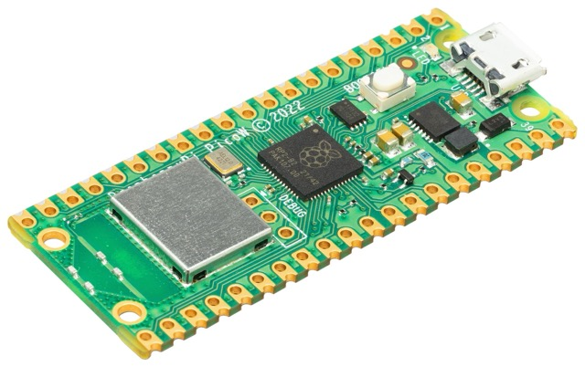
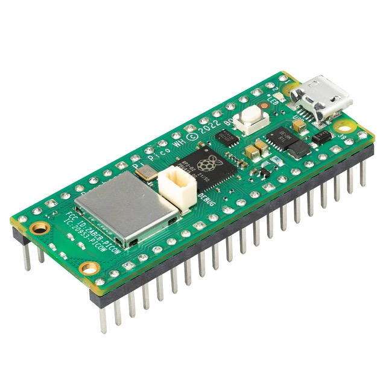
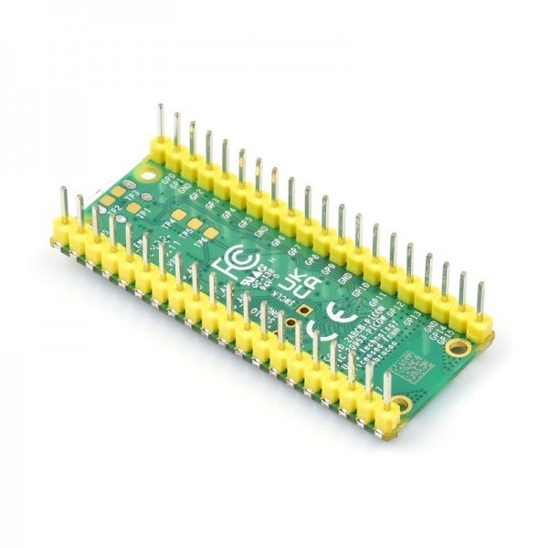
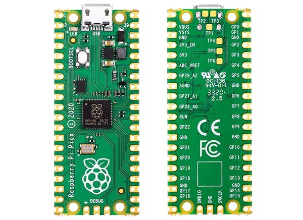
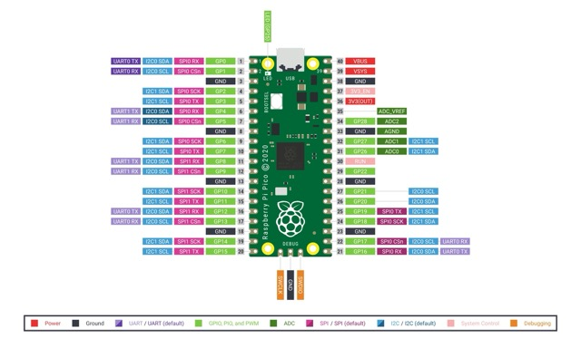
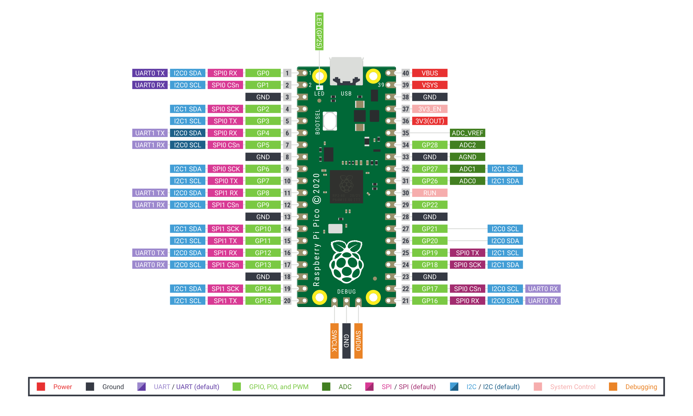

# Proyecto: Plantilla básica para comenzar proyectos en Raspberry Pi Pico con Micropython

El contenido de este repositorio tiene la única finalidad de utilizarse como
plantilla al crear otros proyectos reutilizando partes que suelo necesitar
de forma recurrente para acelerar el desarrollo.

Sitio web del autor: [https://raupulus.dev](https://raupulus.dev)



Repository [https://gitlab.com/raupulus/rpi-pico-template-project-micropython](https://gitlab.com/raupulus/rpi-pico-template-project-micropython)

Una de las ventajas es que en **Models** ya disponemos de dos modelos que
suelen ser fundamentales para mi: 

- API: Para interactuar fácilmente con mis apis enviando/recibiendo datos
- RpiPico: Representa a la raspberry: incluye conectividad wireless, gestión de
  ADC integrado, puede obtener información de la red y conectar a redes 
  alternativas por si nos desplazamos (usamos en varias ubicaciones) o 
  necesitamos un respaldo, información de temperatura...

Además de algunos parámetros básicos en el archivo de variables de entorno
que usamos como base **.env.example.py**

<p align="center">
  
  
  
  
</p>

## Software y Firmware

- IDE/Editor (EJ: thonny, pycharm o vscode)
- [MicroPython 1.28](https://micropython.org/download/rp2-pico/) instalado 
  en la Raspberry Pi Pico.

## Contenido del Repositorio

- **src/**: Código fuente del proyecto.
- **src/Models**: Modelos/Clases para separar entidades que intervienen.
- **src/Drivers**: Drivers específicos de hardware (p. ej., CC1101 para 868 MHz).
- **docs/**: Documentación adicional, esquemas y guías de instalación.

## Instalación

1. **Instalación de MicroPython:**
   - Asegúrate de que MicroPython esté instalado en tu Raspberry Pi Pico. Puedes seguir las instrucciones en la [documentación oficial](https://docs.micropython.org/en/latest/rp2/quickref.html).

2. **Cargar el Código:**
   - Descarga o clona este repositorio.
   - Copia el archivo *.env.example.py* a *env.py* y rellena los datos para 
     conectar al wireless además de la ruta para subir datos a tu API.
   - Si vas a usar el CC1101, revisa y adapta en env.py la sección "CC1101" con los pines y parámetros.
   - Copia los archivos en la carpeta `src/` a la Raspberry Pi Pico.

## CC1101 en Raspberry Pi Pico (868 MHz)

- Cableado recomendado (según el issue):
  - VCC -> 3V3 (pin 36)
  - GND -> GND
  - MOSI -> GP19 (SPI0 TX)
  - MISO -> GP16 (SPI0 RX)
  - SCLK -> GP18 (SPI0 SCK)
  - CSN  -> GP17 (SPI0 CS) Con resistencia 10k Pull Up (a 3,3v)
  - GDO0 -> GP20 (opcional)
  - GDO2 -> GP21 (opcional)
- Configura estos pines en env.py (variables CC1101_*). Por defecto ya coinciden con el cableado anterior.
- En main.py, si `ENABLE_CC1101 = True`, se inicializa el driver y se usa un bucle de polling rápido (sin IRQ) que lee paquetes en cuanto están completos. Al llegar una trama válida se hace parpadear alternamente dos LEDs externos y se agregan los datos. Cuando hay un conjunto completo (temperatura, humedad, viento y lluvia), se envía inmediatamente a la API encendiendo un tercer LED durante el envío.
- Para depuración, puedes activar `SHOW_ALL_DECODED = True` en `src/env.py` y se imprimirán por consola todos los mensajes decodificados (aunque no formen aún un conjunto completo o no sean los que necesitas). Con `False` (por defecto) sólo verás la información habitual.
- Modo búsqueda de IDs: si no conoces el ID de tu estación, establece `FIND_STATION_IDS = True` en `src/env.py`. En este modo:
  - El firmware se centra en decodificar y mostrar IDs detectados sin agregar datos ni subir a la API.
  - Además se intentan extraer "IDs candidatos" de cada paquete aunque no se consiga decodificarlo completamente (útil en entornos ruidosos). Controlado por `FIND_ID_STRICT`.
  - Verás por consola líneas del tipo `ID detectado: <id>  tipo: <type>  chan: <chan>` (decodificación completa) y/o `ID candidato: <id>` (detección por paridad o digest), además de un resumen periódico de todos los IDs vistos.
  - Cuando identifiques tu ID, puedes ponerlo en `SENSOR_IDS_INC` para filtrar el resto.
- Flags avanzados del decodificador (src/env.py):
  - `FORCE_BRESSER_MODEL`: None | '5in1' | '6in1' para forzar el tipo de trama a intentar primero (reduce falsos positivos en entornos ruidosos).
  - `SENSOR_IDS_INC` / `SENSOR_IDS_EXC`: listas de IDs a incluir/excluir tras decodificar (útil si hay varios sensores cerca).
  - `DECODE_DEBUG`: imprime razones de rechazo de tramas (digest/checksum/paridad/BCD inválido). Úsalo sólo para diagnóstico, produce mucho log.
  - Decodificación flexible 5‑en‑1/6‑en‑1: el receptor trabaja por defecto con PKTLEN=27 (AA 2D) y el decodificador prueba primero bloques de 18B (6‑en‑1) y luego 26/27B (5‑en‑1), con opción de ventana deslizante.
  - `ALLOW_SLIDING_DECODE`: Si True, habilita un escaneo de ventanas (18B y 26B) dentro del paquete para intentar decodificar tramas desalineadas. Por defecto False para evitar falsos positivos.
  - `FIND_ID_STRICT`: Si True, al buscar IDs 5‑en‑1 exigirá también checksum por conteo de bits; si False, aceptará coincidencias por paridad para facilitar el descubrimiento del ID.

## LEDs

El proyecto utiliza 5 LEDs:

| LED | GPIO | Color | Variable (`env.py`) | Descripción |
|-----|------|-------|---------------------|-------------|
| Integrado (onboard) | — | Verde | `ENABLE_ONBOARD_LED` | Se enciende al arrancar y permanece encendido siempre. Indica que hay alimentación. |
| LED ON | GPIO15 | Verde | `LED_ON_PIN` | Encendido mientras el sistema está en el bucle principal esperando datos. Se apaga al recibir una lectura completa y vuelve a encenderse tras la subida. |
| LED 1 | GPIO7 | Rojo | `LED_READ_PIN` | Se enciende al subir datos a la API y se apaga al terminar el envío. |
| LED Azul 1 | GPIO13 | Azul | `LED_ALT1_PIN` | Parpadea al decodificar correctamente una trama recibida. Forma un juego de luces alternado con el LED Azul 2. |
| LED Azul 2 | GPIO14 | Azul | `LED_ALT2_PIN` | Parpadea al decodificar correctamente una trama recibida. Forma un juego de luces alternado con el LED Azul 1. |

Los dos LEDs azules realizan un parpadeo alternado para indicar visualmente que se han recibido y decodificado datos correctamente por radio.

## Botones

El proyecto contempla dos botones (el código está preparado pero comentado, sin funcionalidad activa actualmente):

- **Reset**: Conectado por hardware. Puentea el pin `RUN` a `GND` para forzar el reinicio del microcontrolador.
- **Botón 1** (GPIO2): Reservado para uso futuro con una pantalla ST7735 (encender/apagar/cambiar vista). La pantalla no está implementada todavía.

## Wi-Fi y redes alternativas

La conectividad Wi-Fi se configura en `src/env.py`:

```python
# Red principal
AP_NAME = "nombre_de_tu_red"
AP_PASS = "contraseña"

# Redes alternativas (respaldo o uso en varias ubicaciones)
ALTERNATIVES_AP = [
    {"ssid": "red_alternativa_1", "password": "contraseña1"},
    {"ssid": "red_alternativa_2", "password": "contraseña2"},
]
```

Si la red principal no está disponible, el dispositivo intentará conectarse a las redes de `ALTERNATIVES_AP` en orden. Útil cuando el dispositivo se usa en varias ubicaciones o se necesita una red de respaldo.

Para deshabilitar la conectividad Wi-Fi completamente: `WIFI_ENABLED = False`.

## API — Datos enviados

Cuando hay un conjunto completo de mediciones (temperatura, humedad, viento y lluvia), se realiza un `POST` a la URL configurada en `API_URL` + `API_PATH`. El cuerpo de la petición es JSON con la siguiente estructura:

```json
{
    "hardware_device_id": 1,
    "temperature": 21.4,
    "humidity": 65,
    "wind_speed": 1.2,
    "wind_average_speed": 1.2,
    "wind_min_speed": 1.2,
    "wind_max_speed": 3.5,
    "wind_grades": 180.0,
    "rain": 0.0,
    "rain_intensity": 0.0,
    "rain_month": 12.5,
    "data": {
        "temperature": 21.4,
        "humidity": 65,
        "wind_speed": 1.2,
        "wind_average_speed": 1.2,
        "wind_min_speed": 1.2,
        "wind_max_speed": 3.5,
        "wind_grades": 180.0,
        "rain": 0.0,
        "rain_intensity": 0.0,
        "rain_month": 12.5
    }
}
```

Los campos principales también se incluyen dentro de `data` (formato de compatibilidad). Los campos con valor `null` se omiten del nivel raíz pero se mantienen dentro de `data` (útil en envíos parciales por timeout).

La autenticación se realiza mediante cabecera `Authorization: Bearer <API_TOKEN>`.

Para deshabilitar el envío a la API: `API_ENABLED = False`.

## Esquema de la raspberry pi pico



## Licencia

Este proyecto está licenciado bajo la Licencia GPLv3. Consulta el archivo 
LICENSE para más detalles.